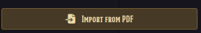

# Vagabond PDF Importer

A Foundry VTT module that imports Vagabond characters from the official PDF character sheet.

## Requirements

- Foundry VTT v12+
- The [Vagabond](https://foundryvtt.com/packages/vagabond) system

## How to Use

### Step 1 — Create Your Character

Go to [https://vgbnd.app/](https://vgbnd.app/) and build your character using the official Vagabond character creator.

### Step 2 — Export as PDF

1. Once your character is ready, navigate to the **Print Hero** section from the Settings in the upper right hand corner
2. Print the page and choose **Save as PDF** to save the file to your computer

### Step 3 — Import into Foundry

1. Open Foundry VTT and navigate to your World
2. On the Actors tabe there is an option at the bottom that says "Import from PDF"

3. Use the **Vagabond PDF Importer** module to import your saved PDF on the Actor Screen
4. Your character will be created as an Actor in Foundry with all stats populated

## Installation

Install via the Foundry VTT package manager using the manifest URL:

```
https://raw.githubusercontent.com/DimitroffVodka/vagabond-pdf-importer/main/module.json
```

## License

This module is provided as-is for use with the Vagabond system.
